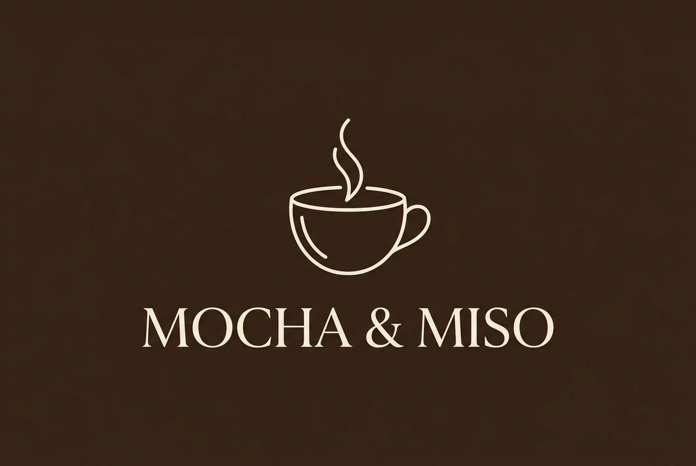
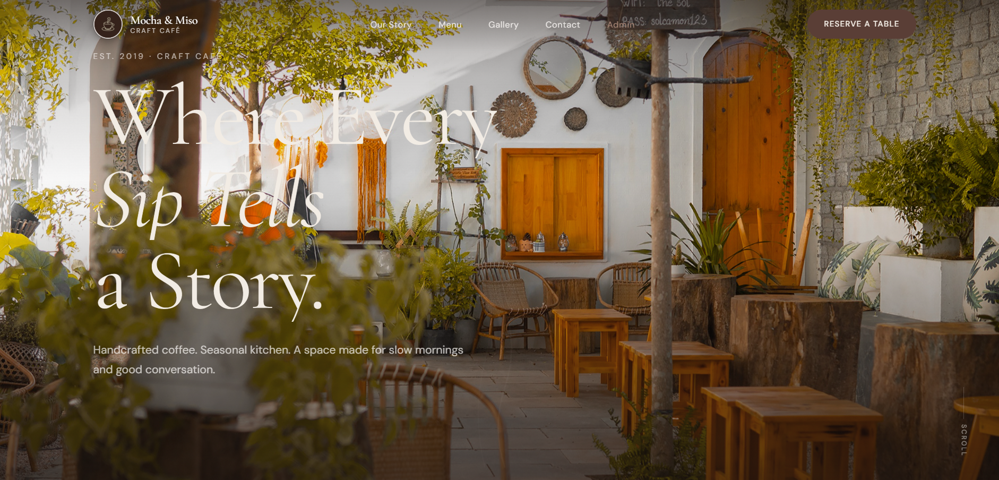
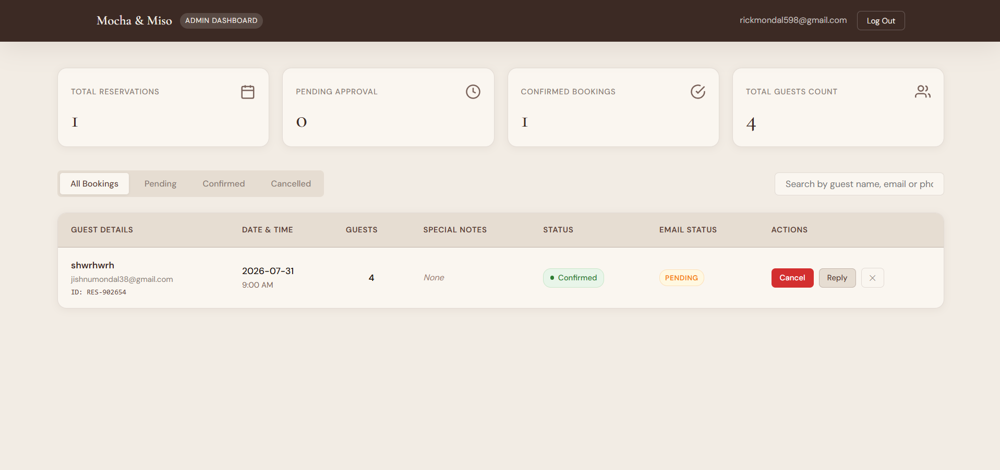

# ☕ Bean & Bloom Café — Café Management System

<div align="center">



**A modern-inspired café management system with a public-facing website, online table reservations, Firebase-powered administration, and automated customer emails.**

[](https://beanandbloomcafe.web.app)

[](https://beanandbloomcafe.web.app/admin.html)

[](https://firebase.google.com/)

[](https://www.emailjs.com/)

</div>

---

## 🌐 Live Demo

### Public Website

**https://beanandbloomcafe.web.app**

### Admin Portal

**https://beanandbloomcafe.web.app/admin.html**

> Admin access requires a registered Firebase Authentication account with the appropriate administrator permissions.

---

# 🖼️ Screenshots

## 🏠 Homepage — Hero Section



## 🛡️ Admin Dashboard



---

# ✨ Features

## 🌐 Public Website

- **Animated Hero Section**
  - Parallax-style visual effects
  - GSAP animations
  - Smooth visual transitions
  - Café branding and call-to-action sections

- **Our Story**
  - Café introduction and brand narrative
  - Scroll-based reveal animations

- **Interactive Menu**
  - Food, drinks, and dessert categories
  - Dynamic category filtering
  - Menu item presentation

- **Signature Drinks**
  - Dedicated showcase for specialty beverages

- **Photo Gallery**
  - Café atmosphere and food photography
  - Responsive gallery layout

- **Online Table Reservation**
  - Customer reservation form
  - Guest name
  - Email
  - Phone
  - Date
  - Time
  - Number of guests
  - Special requests

- **Firebase Firestore Integration**
  - Reservations are stored in Firestore
  - Reservation data is available to the administrator

- **Email Notifications**
  - Reservation confirmation email
  - Confirmed reservation email
  - Cancelled reservation email
  - Admin-to-customer reply emails
  - Powered by EmailJS

- **Contact & Location**
  - Café address
  - Opening hours
  - Contact information
  - Location/map integration

- **Responsive Design**
  - Desktop
  - Tablet
  - Mobile
  - Responsive navigation

- **Custom UI Effects**
  - Custom cursor
  - Hover animations
  - Smooth scrolling
  - Scroll-triggered animations

---

# 🔐 Admin Portal

The admin portal provides a centralized interface for managing customer reservations.

### Authentication

- Firebase Authentication
- Email/password login
- Protected admin dashboard
- Automatic authentication state handling

### Reservation Dashboard

- View all reservations
- View customer details
- View reservation date and time
- View number of guests
- View special requests
- View reservation status
- View email status

### Reservation Management

Administrators can:

- Confirm reservations
- Cancel reservations
- Delete reservations

### Search & Filtering

Reservations can be:

- Filtered by status
  - All
  - Pending
  - Confirmed
  - Cancelled
- Searched by:
  - Guest name
  - Email
  - Phone number

### Dashboard Statistics

The admin dashboard displays:

- Total reservations
- Pending reservations
- Confirmed reservations
- Total guest count

### Customer Communication

Administrators can send emails directly to customers using EmailJS.

The Reply feature allows the administrator to:

- Open a customer's reservation
- View the customer's email
- Enter a subject
- Write a custom message
- Send the email directly to the customer

---

# 📧 Email System

## EmailJS Instead of SMTP

The project originally contained an SMTP/Nodemailer-based email architecture.

For the final deployment, **EmailJS is used instead of SMTP**.

This was done because:

- EmailJS provides a client-side email service suitable for this project
- It avoids requiring a paid SMTP/server infrastructure
- It works with the Firebase Spark/free hosting setup
- No dedicated café email account is required for this demo
- Customer emails can be sent directly from the web application

### Email Flow

```text
Customer
    │
    │ submits reservation
    ↓
Firebase Firestore
    │
    │ reservation saved
    ↓
EmailJS
    │
    ↓
Customer Email